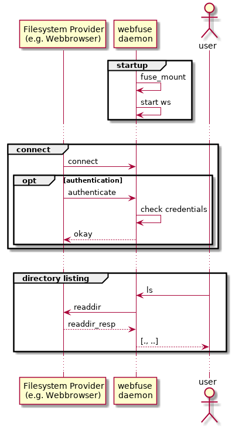

# webfuse

webfuse combines libwebsockets and libfuse. It allows ot attach a remote filesystem via websockets.

## Contents

-   [Motivation](#Motivation)
-   [Fellow Repositories](#Fellow-Repositories)
-   [Concept](#Concept)
-   [Similar Projects](#Similar-Projects)
-   [Further Documentation](#Further-Documentation)

## Motivation

Many embedded devices, such as smart home or [IoT](https://en.wikipedia.org/wiki/Internet_of_things) devices are very limited regarding to their (non-volatile) memory resources. Such devices are typically comprised of an embedded linux and a small web server, providing an interface for maintenance purposes.

Some use cases, such as firmware update, require to transfer (larger) files to the device. The firmware file is often stored multiple times on the device:

1.  cached by the web server, e.g. [lighttpd](https://redmine.lighttpd.net/boards/2/topics/3451)
2.  copied to locally, e.g. /tmp
3.  uncompressed, also to /tmp

Techniques like [SquashFS](https://en.wikipedia.org/wiki/SquashFS) help to avoid the third step, since the upgrade file can be mounted directly. [RAUC](https://rauc.io/) shows the use of SquashFS within an update facility.  
However at least one (unecessary) copy of the upload file is needed on the device.

To avoid Steps 1 and 2, it would be great to keep the update file entirely in web server, just like [NFS](https://en.wikipedia.org/wiki/Network_File_System) or [WebDAV](https://wiki.archlinux.org/index.php/WebDAV). Unfortunately, NFS is not based on any protocol, natively usable by a web application. WebDAV is based on HTTP, but it needs a server providing the update file.

webfuse solves this problem by using the [WebSocket](https://en.wikipedia.org/wiki/WebSocket) protocol. The emdedded device runs a service, known as webfuse adapter, awaiting incoming connections, e.g. from a web browser. The browser acts as a file system provider, providing the update file to the device.

## Fellow Repositories

-   **[webfuse-example](https://github.com/falk-werner/webfuse-example)**: Example of webfuse
-   **[webfused](https://github.com/falk-werner/webfused)**: Reference implementation of webfuse daemon
-   **[webfuse-provider](https://github.com/falk-werner/webfuse-provider)**: Reference implementation of webfuse provider

## Concept

With webfuse it is possible to implement remote filesystems based on websockets.
A reference implementation of such a daemon is provided within the examples. The picture above describes the workflow:

-   The websocket filesystem daemon (*webfuse daemon*) waits for incoming connections.

-   A remote filesystem provider connects to webfuse daemon via websocket protocol and adds one or more filesystems.  
    *Note: the examples include such a provider implemented in HTML and JavaScript.*

-   Whenever the user makes filesystem requests, such as *ls*, the request is redirected via webfuse daemon to the connected filesystem provider

### Adapters and Providers

In webfuse, an adapter is a component that adapts the libfuse API to a websocket interface.
Currently, libwebfuse implements only a server based adapter - a websocket server, that allows clients to connect a remote file system which
is represented via libfuse on the server side.

In webfuse, a provider is a component that provides a filesystem via websocket interface.
Currently, libwebfuse implements only a client based provider - a websocket client that provides a local filesystem to a remote server.

## Similar Projects

### Davfs2

[davfs2](http://savannah.nongnu.org/projects/davfs2) is a Linux file system driver that allows to mount a [WebDAV](https://wiki.archlinux.org/index.php/WebDAV) resource. WebDAV is an extension to HTTP/1.1 that allows remote collaborative authoring of Web resources.

Unlike webfuse, davfs2 mounts a remote filesystem locally, that is provided by a WebDAV server. In contrast, webfuse starts a server awaiting client connections to attach the remote file system.

## Further Documentation

-   [Build instructions](doc/build.md)
-   [Webfuse Protocol](doc/protocol.md)
-   [API](doc/api.md)
