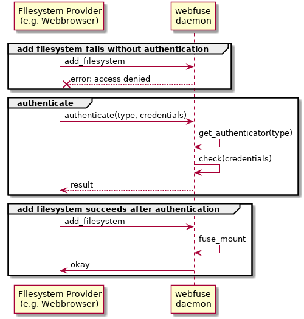

# Webfuse API introduction

This introduction provides a general overview to webfuse API.
Please refer to the [build instructions](build.md) to generate API reference documentation.

## Contents

-   [Authentication](#Authentication)

## Authentication

By default, webfuse daemon will redirect each filesystem call to the first connected provider without any authentication.
This might be good for testing purposes or when an external authentication mechanism is used. In some use cases, explicit authentication is needed. Therefore, authentication can be enabled within webfuse daemon.

When authentication is enabled, filesystem calls are only redirected to a connected provider, after `authenticate`
has succeeded.

### Enable authentication

Authentication is enabled, if one or more authenticators are registered via `wf_server_config`.

    static bool authenticate(struct wf_credentials * creds, void * user_data)
    {
        char const * username = wf_credentials_get(creds, "username");
        char const * password = wf_credentials_get(creds, "password");

       return ((NULL != username) && (0 == strcmp(username, "bob")) &&
               (NULL != password) && (0 == strcmp(password, "???")));
    }

    wf_server_config * config = wf_server_config_create();
    wf_server_config_add_authenticator(config, "username", &authenticate, NULL);

    wf_server * server = wf_server_create(config);
    //...

### Authenticator types and credentidals

Each authenticator is identified by a user defined string, called `type`. The type is provided by the `authenticate` request, so you can define different authenticators for different authentication types, e.g. username, certificate, token.

Actually, only one type is used: **username**  
**It is strongly recommended to prefix custom authenticator types with an underscore (`_`) to avoid name clashes.**

The `wf_credentials`struct represents a map to access credentials as key-value pairs, where both, key and value, are of type string.

#### username

The authenticator type **username** is used to authenticate via username and password. Valid credentials should contain two keys.

-   **username** refers to the name of the user
-   **password** refers to the password of the user

**Note** that no further encryption is done, so this authenticator type should not be used over unencrypted websocket connections.
